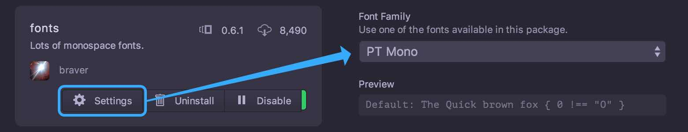
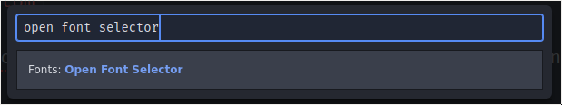
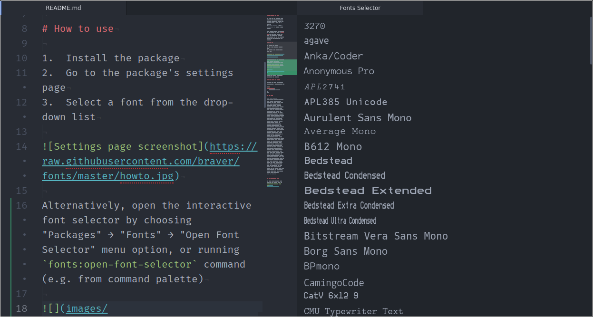

# Fonts package for Atom

Oh we do love our monospace fonts don't we? To celebrate typography and free choice, I've packaged all the great fonts I could get my hands on
(<!-- BEGIN NUM_FONTS -->121<!-- END NUM_FONTS --> of them at this point).

This package delivers them straight to Atom through the power of @font-face. You no longer need to hunt down and install your favourite font, instead you can now instantly try out any of the fonts in this package.

# How to use

1.  Install the package
2.  Go to the package's settings page
3.  Select a font from the drop-down list



Alternatively, open the interactive font selector by choosing "Packages" → "Fonts" → "Open Font Selector" menu option, or running `fonts:open-font-selector` command (e.g. from command palette)





Disable the package to re-enable the normal font settings.

# How to change the UI font

Add this rule (with your favorite font-family) to your style.less file

```css
atom-workspace {
    font-family: Mononoki;
}
```

## All fonts

<!-- BEGIN FONTS -->
agave, Anka/Coder, Anonymous Pro, APL2741, APL385 Unicode, Aurulent Sans Mono, Average Mono, B612 Mono, Bedstead, Bedstead Condensed, Bedstead Extended, Bedstead Extra Condensed, Bedstead Ultra Condensed, Bitstream Vera Sans Mono, Borg Sans Mono, BPmono, CamingoCode, CatV 6x12 9, CMU Typewriter Text, Code New Roman, Consolamono, Corbi Mono S, Courier Prime, Courier Prime Code, Cousine, Cutive Mono, DaddyTimeMono, DejaVu Mono, DejaVu Sans Mono - Bront, Droid Sans Mono, Droid Sans Mono Dotted, Droid Sans Mono Slashed, Effects Eighty, Fairfax HD, Fantasque Sans Mono, Fantasque Sans Mono No Loop K, Fifteen, FiraCode, FiraCode Light, Fira Mono, Fixedsys, Fixedsys Excelsior, Fixedsys Ligatures, Generic Mono, GNU Freefont, GNU Unifont, Gohufont 11, Gohufont 14, Go Mono, Hack, Hasklig, Hasklig Light, Hasklig Medium, Hermit, Hermit Light, iA Writer Mono S, IBM 3270, IBM 3270 Narrow, IBM 3270 Semi-Narrow, Inconsolata, Inconsolata-g, Iosevka, Iosevka Extra Light, Iosevka Light, Iosevka Medium, Iosevka Thin, Kawkab Mono, Kawkab Mono Light, Latin Modern Mono, Latin Modern Mono Light, League, Lekton, Liberation Mono, Libertinus Mono, Luculent, Luxi Mono, M+, M+ Light, M+ Medium, M+ Thin, Meslo, Meyrin, Monodeco, Monodeco Light, Monofur, Monoid, Mononoki, NotCourierSans, Noto, Nova Mono, Office Code Pro, Office Code Pro Light, Office Code Pro Medium, OpenDyslexicMono, Overpass Mono, Oxygen Mono, Plex Mono, Press Start 2P, Profont, Proggy Clean, PT Mono, Quinze, Roboto Mono, Roboto Mono Light, Roboto Mono Medium, Roboto Mono Thin, saxMono, Share Tech Mono, SK Modernist, Source Code Pro, Source Code Pro Extra Light, Source Code Pro Light, Source Code Pro Medium, Space Mono, Sudo, Terminus, TeX Gyre Cursor, Ubuntu Mono, Ubuntu Mono - Bront, Verily Serif Mono, VT323
<!-- END FONTS -->


## More programming fonts

-   Test drive these (and more) fonts in your browser using the [Programming Fonts Test Drive App](http://app.programmingfonts.org)
